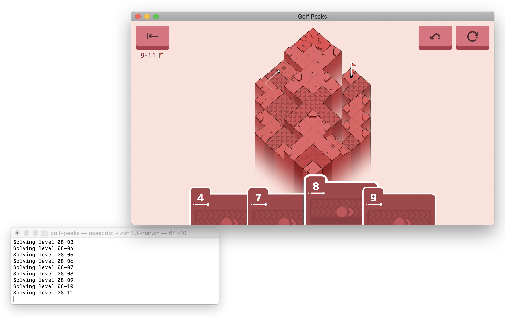

# Golf Peaks

A solver that completes levels in [Golf Peaks](https://afterburn.itch.io/golf-peaks/) from [Afterburn Games](http://afterburn.games/).

If you'd like to know more you can [watch it in action](https://vimeo.com/455241666), or read about it on my blog.

- [Building a Solver for Golf Peaks](https://nicholas.cloud/blog/building-a-solver-for-golf-peaks/)
- [Speeding Up a Solver for Golf Peaks](https://nicholas.cloud/blog/speeding-up-a-solver-for-golf-peaks/)

You can find also find instructions on to complete each level in [`solutions.txt`](./solutions.txt).



## Usage

Tested against the current macOS release (`v3.02`), though levels may differ slightly between platforms/releases.

The first few worlds were originally completed using handwritten level files, but later I was able to use the source level files which the Afterburn team were awesome and sent to me. Seeing as I don't own these files I'm not including them here, but if you'd like a copy you can email the creators.

```sh
# Solve a level from the source level file
tar -xf /path/to/gp_levels.zip
cat gp_levels/roll_1.asset | python3 parse.py | cargo run
```

The solver can also produce AppleScript instructions that execute the key presses necessary to solve a level. You'll need to be using macOS, and grant permission for your terminal to control your computer.

Open the level you want to solve, and feed the solver's (AppleScript) output into an OSA interpreter.

In some levels the order of cards in the player's hand is different between the source file and the macOS release. There's a patch to correct these files.

```sh
# Check that your terminal has permission to control your computer
# System Preferences > Settings & Privacy > Privacy > Accessibility
osascript -e 'tell application "System Events" to key code 36'

# Make sure the cards are in the correct order for macOS release v3.02
patch -p1 < fix-levels.patch

cat gp_levels/roll_1.asset | python3 parse.py | cargo run -q -- --applescript | osascript -i
```

## Notes

These are just general notes from development about movement in the game that I made for reference.

### General Movement

There are three types of moves available.

- Rolling along the ground
- Chipping into the air
- Chipping into the air, then rolling after landing

Each move will travel a specific distance (through the air or rolling along the ground) before stopping.

A level is passed when the ball ends up in the hole. This might be because the ball stopped on the hole's tile, or because it was airborne and landed on the hole's tile.

### Walls

If a ball is rolling along the ground and it runs into a tile higher than it's current tile, it will bounce back in the oppositve direction. Airborne balls will clear all walls.

### Corners

Corners will reflect a rolling ball in a new direction. If the ball hits the back of a corner, it will bounce back in the opposite direction like a wall.

_For example, a ball heading south will bounce back if it run into a tile with a corner on its north side (whether NE/NW)._

### Slopes

Balls that land on a slope will begin rolling in the direction of the slope. When a ball is rolling down a slope, it will still lose energy as if it was rolling along regular ground. If a ball rolling down a slope runs out of energy, it will keep rolling until it reaches the bottom of the slope.

The only exception to this slope behaviour is if the ball is rolling along the ground and it begins heading directly uphill. If it runs out of energy while still going uphill, it will stop and turn around, rolling back to the bottom of the slope.

### Sand Traps

Balls that land on sand traps will lose all momentum. The only way for a ball to leave a trap is with an airborne move (it is a waste to use a rolling move).

### Quicksand

Quicksand behaves much like regular ground, except the level is failed if the balls stops moving on a quicksand tile.

### Water Hazards

Balls that land in water will be placed back on the last patch of _stable_ ground they rolled across. This might be where the original putt took place, or it might have been somewhere along the journey. Airborne balls that land in water will be set back to where they originated from.

### Springs

Springs launch rolling balls into the air, converting their rolling energy into airborne energy.

Note that a ball is only launched airborne when it _enters_ the tile, not if it stops on the spring and is moved again after that. If it rebounds off a wall though it will be launched, since it has "re-entered" the current tile.

### Portals

Portals come in pairs and behave similar to holes. A ball will be teleported to the corresponding exit portal if it either stops on the entry portal or lands in it after being airborne. If an airborne ball landing in a portal has remaining rolling energy, it will continue travelling after leaving the exit portal.

### Conveyor Belts

Conveyor belts are similar to slopes, except that the ball will only begin following the conveyor once it runs out of energy and stops.

### Ice

A ball that stops moving while on ice will continue rolling in its current direction until it either hits a wall and stops where it is, or leaves the ice.
